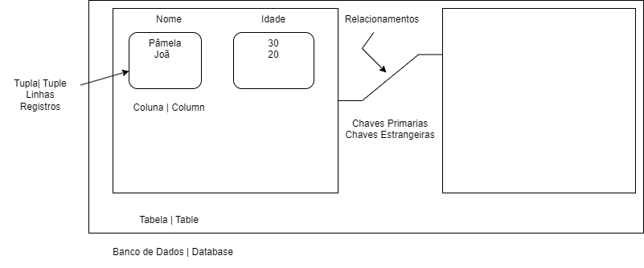
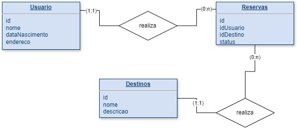

# Banco de Dados

## O que é um banco de dados?
Coleção organizada de informações ou dados, ela é estruturada e armazenada de forma digital.
Tipos de Banco de Dados mais usados
* Relacionais/SQL
* Não Relacionais/NoSQL (Not OnlySQL)
* Orientado a Objetos
* Hierárquico
## Alguns SGBD
* PostgreSQL
* MySQL
* SQLite
* MariaDB
* mongoDB

## Funcionalidades básicas de um SGBD
* C (Create)
* R (Read)
* U (Update)
* D (Delete)

# Banco de Dados Relacional

## Estrutura de um BD Relacional

## Características BD Relacional
* Relacionamento entre tabelas
* Linguagem de Consulta Estruturada (SQL)
* Integridade referencial (relacionamentos entre as tabelas)
* Normalização de dados (estruturação)
* Segurança
* Flexibilidade (aceita alterações)
* Suporte a transação ACID
	* ACID
		* Atomicidade -> todas operações sejam executadas com sucesso ou que nenhuma seja executada
		* Consistência -> garantir que transações saiam de um estado consistente para outro consistente
		* Isolamento -> cada transação é executada de forma isolada, sem interferir nas transações concorrentes
		* Durabilidade -> após uma alteração efetuada, a mesma se torna permanente
		
[Ler mais sobre Banco de Dados Relacional](https://www.oracle.com/br/database/what-is-a-relational-database/)

# SQL - Structured Query Language

## Introdução
É uma linguagem padronizada. Ela nos auxilia na construção de comandos para criação de tabelas, armazenamento de 
informações, consulta de informações, atualização de informações e até mesmo deleção dessas informações.
Teve seu surgimento por volta de 1970 e teve sua evolução para se tornar um padrão internacionalmente conhecido
devido a sua facilidade.

## Organização da SQL
Divididos em alguns tipos de declarações:
* DQL - Linguagem de Consulta de Dados
	* SELECT;
* DML - Linguagem de Manipulação de Dados
	* INSERT, UPDATE e DELETE;
* DDL - Linguagem de Definição de Dados (Estruturação dos dados)
	* CREATE, ALTER, DROP;
* DCL - Linguagem de Controle de Dados (Permisionamentos de acessos)
	* GRANT, REVOKE
* DTL - Linguagem de Transação de Dados
	* BEGIN, COMMIT, ROLLBACK

## Sintaxe Básica: Nomenclatura
* Os nomes devem começar com uma letra ou um caracter de sublinhado (_)
* Os nomes podem conter letras, números e caracteres de sublinhando (_)
* Sensibilidade a maiúsculas e minúsculas
Essas são algumas regras, mas podem mudar dependendo do SGBD 

[Ler mais sobre SQL](https://www.sqltutorial.org/)

# MER e DER: Modelagem de Banco de Dados
## MER e DER
O Modelo Entidade-Relacionamento (MER) é representado através de diagramas chamados Diagramas Entidade-Relacionamento
(DER).

Programas online para criar modelos:
[Creately](https://app.creately.com/)
[Draw.io](https://app.diagrams.net/)
[QuickBD](https://app.quickdatabasediagrams.com/#/)

### Entidades
As entidades são nomeadas com substantivos concretos ou abstratos que representam de forma clara sua função dentro do
domínio.

### Atributos
Os atributos são as características ou propriedades das entidades. Eles descrevem informações específicas sobre uma
entidade.

### Relacionamentos
Os relacionamentos representam as associções entre entidades.

### Cardinalidade
Ela pode ser definida como:
* Relacionamento 1..1 (um para um)
* Relacionamento 1..n ou 1..* (um para muitos)
* relacionamento n..n ou *..* (muitos para muitos)

