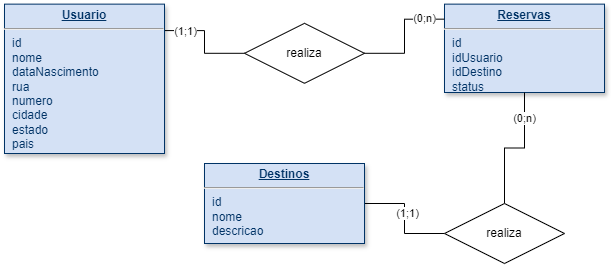

# Normalização de Dados

## Introdução
A normalização de dados é um processo no qual se organiza e estrutura um banco de dados relacional de forma a eliminar
redundâncias e anomalias, garantindo a consistência e integridade dos dados.

## Problemática Exmplo
Em nosso banco de dados de exemplo temos endereço cadastrado com muitas informações como rua, número, cidade e estado.

## Formas Normais

### 1FN: Atomicidade de dados
A 1FN estabelece que cada valor em uma tabela deve ser atômico, ou seja, indivisível. Nenhum campo deve conter múltiplos
valores ou listas. No seu caso, o campo "endereco" contém múltipls valores, como rua, número, cidade e estado. PAra 
atingir a 1FN, precisamos dividir o campo "endereco" em colunas separadas.

### 2FN:
* A 2FN estabelece que uma tabela deve estar na 1FN
* Todos os atributos não chave devem depender totalmente da chave primária
Dica: Se sua tabela tem uma chave primária simples não existe a possibilidade de termos dependência parcial e por tanto
ela já se encontra na 2FN
** Afeta chaves primárias compostas

### 3FN:
* Uma tabela deve estar na 2FN
* Nenhuma coluna não-chave depender de outra coluna não-chave
Nosso exemplo: Relação Estado -> Cidade

### Resumo
* 1FN garante que cada valor seja atômico e que os registros sejam únicos e identificáveis
* 2FN garante que os atributos não chave dependam totalmente da chave primária, evitando dependências parciais
* 3FN elimina dependências transitivas entre os atributos não chave, garantindo que cada atributo não chave dependa
  apenas da chave primária, não havendo dependências indiretas entre eles

[Leitura Formas Normais](https://pt.wikipedia.org/wiki/Normaliza%C3%A7%C3%A3o_de_dados)