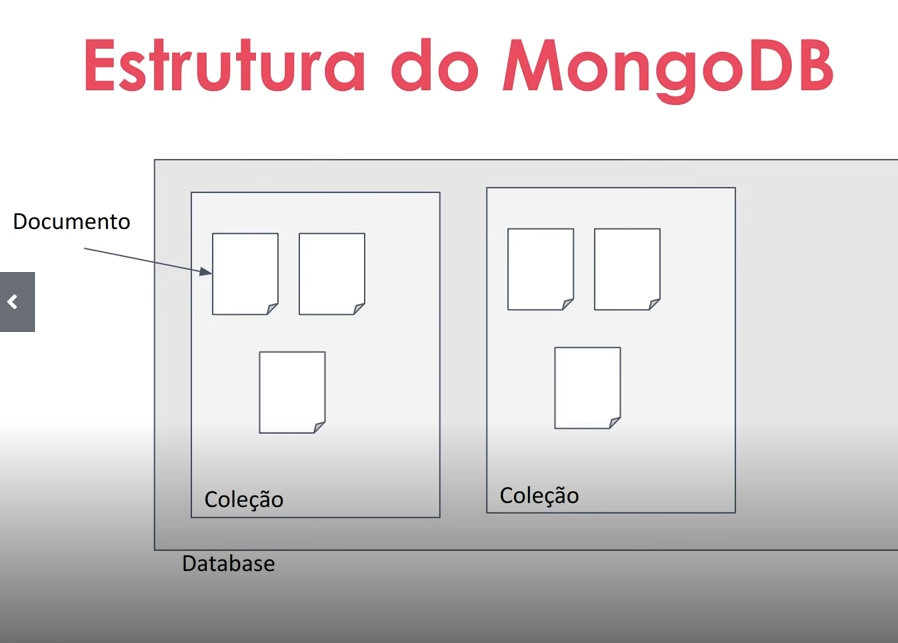

# O que é o MongoDB
* Banco de dados NoSQL orientado a documentos
* Grandes volumens de dados, escalabilidade horizontal e modelagem flexível
* Não exige um esquema
* Permite que os documentos seham armazenados em formato BSON (Binary JSON), proporcionando uma estrutura 
  semiestruturada



# Vantagens:
* Flexibilidade na modelagem de dados
* Escalabilidade horizontal para lidar com grandes volumes de dados
* Consultas ricas e suporte a consultas comlplexas
* Alta disponibilidade e tolerância a falhas
* Comunidade aiva e recursos de suporte

# Onde o MongoDB é usado:
* Aplicação web: Onde a flexibilidade e a escalabilidade são cruciais para lidar com volumes variáveis de dados
* Aálise de big data: Amálise de grandes volumes de dados não estruturados ou semiestruturados, fornecendo uma 
plataforma para armazenar e processar esses dados
* Armazenamento de dados semiestruturados: Permite a inserção de documentos com estruturas deiferentes em uma mesma 
coleção
* Casos de uso de geolocalização: Com suas funcionalidades de consulta geoespacial, é adequado para casos de uso que
envolvem dados baseados em localização, como aplicativos de mapeamento e rastreamento

# Instalação e configuração do MongoDB (Atlas)

https://www.mongodb.com/products/platform/cloud

# Modelagem de dados usando documentos
* É possível ter mais do que 1 database
* Database é composto por um conjunto de coleções

## Coleções
* Agrupamento lógico de documentos
* Não exige esquema ou que os documentos tenham a mesma estrutura

## Características:
* Os nomes das coleções devem seguir algumas regras:
    * Devem começar com uma letra ou um undescore (_)
    * Podem conter letras, números ou underscores
    * Não podem ser vazios
    * Não podem ter mais de 64 bytes de comprimento

## Documentos:
* São amazenados em documentos BSON (Binary JSON), que são estruturas flexíveis e semiestruturadas
* Cada documento possui um identificador único chamado "_id"
* É composto por pares de chaves e valores
* tamanho máximo: Cada documento no MongoDB pode ter um tamanho máximo de 16MB
* Aninhamento de documentos
* Flexibilidade na evolução do esquema

## Tipos de Dados Simples
* String
* Number
* Boolean
* Date
* Null
* ObjectId

## Tipos de Dados Complexos
* Array
* Documento Embutido (Embedded Document)
* Referência (Reference)
* GeoJSON

## Estrutura de um documento
```json
{
    _id:ObjectId(""),
    "nome_campo": "valor_campo",
    ...
}
```
[Criar arquivo JSOn](https://jsonformatter.curiousconcept.com/)

# Estratégias de modelagem de dados eficientes e escaláveis

## Modelagem orientada por consultas
* A modelagem de dados no MongoDB deve ser orientada pelas consultas que serão realizadas com mais frequência
    * Quais os tipos de consultas que eu vou utilizar?
## Inner Documents
* No MongoDB, é comum denormalizar os dados para evitar operações de junção (join) custosas. Isso significa que os dados
relacionados podem ser armazenados juntos em um único documento, em vez de serem distribuídos em várias coleções
    * Normal ter informações duplicadas
Quando usar:
* Os dados aninhados são específicos para o documento pai
* Os dados aninhados são sempre acessados juntamente com o documento pai
* A cardinalidade do relacionamento é um-para-muitos (um usuário pode ter várias reservas)

Quando não usar:
* Se os dados aninhados precisarem ser consultados e atualizados independentemente do documento pai, é mais adequado
utilizar coleções separadas

```json
{
   "_id":1,
   "nome":"Tiago Tardelli",
   "idade":37,
   "data_nascimento":"1987-03-21",
   "enderecos":[
      {
         "logradouro":"Rua Leônidas de Góes ...",
         "numero":123,
         "bairro":"Bairro",
         "cidade":"São Paulo"
      }
   ],
   "interesses":[
      "kart",
      "culinaria"
   ],
   "reservas":[
      {
         "data":"2023-10-10",
         "status":"pendente",
         "destino":"ObjectId(""123"")"
      }
   ]
}
```


## Referências
* Forma de relacionar os documentos entre si

Quando usar:
* Os dados têm seu próprio significado e podem ser acessados independentemente do documento pai.
* Os dados têm uma cardinalidade mais alta(por exemplo, vários usuários podem ter reservas)

Quando não usar:
* Se os dados aninhados precisarem ser consultados e atualizados independentemente do documento pai, é mais adequado
utilizar coleções separdas


```json
{
"_id":1,
"nome": "Tiago Tardelli",
"idade": 37,
"data_nascimento": "1987-03-21",
"enderecos": [{
"logradouro": "Rua Leônidas de Góes ...",
"numero": 123,
"bairro": "Bairro",
"cidade": "São Paulo"
}],
"interesses": ["kart", "culinaria"],
"reservas": [ObjectId("123"), ObjectId("234")]
}


{
"_id": ObjectId("123"),
"destino": ObjectId("456"),
"data": "2023-10-10",
"status":"pendente",
"usuario": ObjectId("345")
}
```
